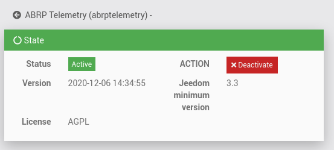
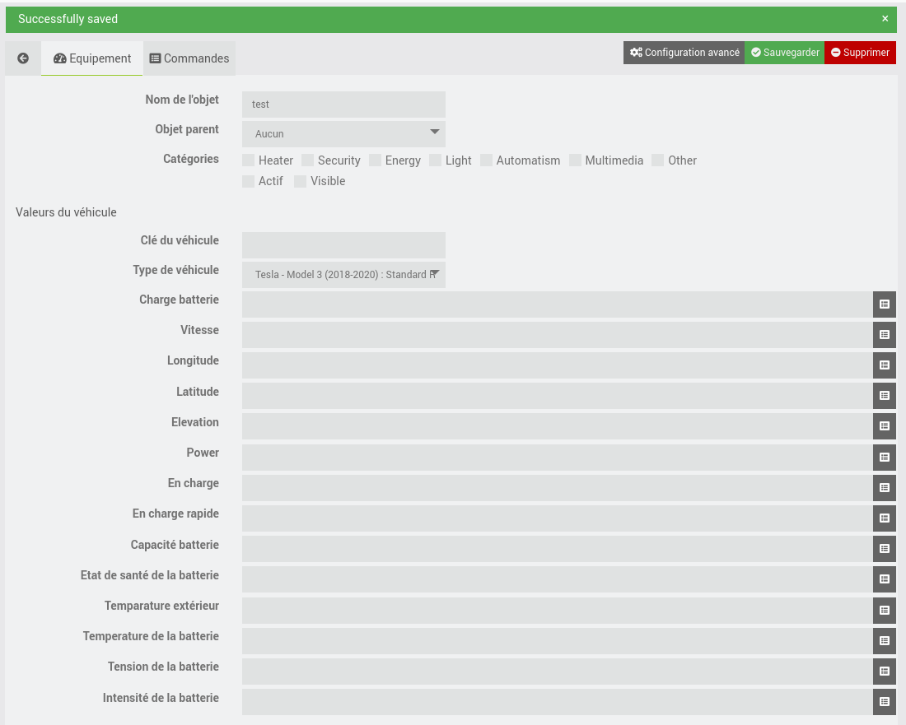
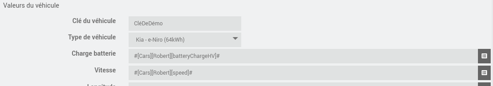
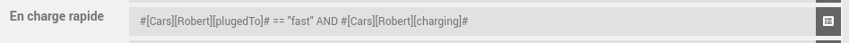
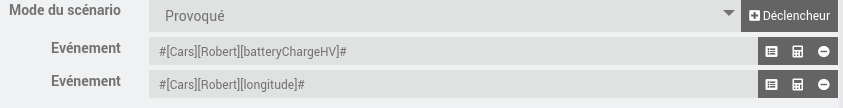
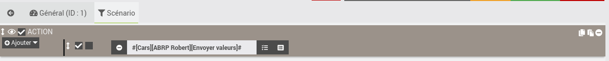

# Plugin ABRP Telemetry

## Introduction

This Jeedom plugin `abrptelemetry` allows to transmit the values of one (or more) electric vehicles to the [ABRP](https://abetterrouteplanner.com/) system.

## Requirements

- Have an electric vehicle,
- Have an ABRP account (free or premium)
- Have your vehicle's information in Jeedom (via a third-party plugin).

You will need a vehicle key. To get the key you'll need to:
- Follow this video [https://youtu.be/XMlHSU-6EPk](https://youtu.be/XMlHSU-6EPk)
Or
- Connect to your [abetterrouteplanner.com](https://abetterrouteplanner.com/) account,
- Click on `Parameters`,
- Click on `Type of vehicle` and choose yours,
- Click on `Add the vehicle`,
- An integration list is offered to you, click on `Jeedom` and copy the provided key.

## Installation

After downloading the plugin, go to its configuration page and activate it.

You are now ready to create your vehicle.

## Vehicle configuration

Access to the vehicle configuration is possible via the plugin menu.

Click on add and give your vehicle a name. You will be redirected to the vehicle file. You will find the usual Jeedom options as well as the vehicle's own configuration.

Start by activating this object by checking the `enabled` box.

Enter in `Vehicle key` the vehicle key provided by abrp in the prerequisites. Then select the type of vehicle from the list of existing models.

All the remaining fields must be completed with the values provided to you by your vehicle.

It is also possible to call functions or use logical operators.

Empty fields will not be transmitted to ABRP.

Save your information.

## Data transmission

Each object has a single command to send vehicle data to ABRP. It is possible to trigger it manually or via a scenario.

To do this, create a scenario in `triggered` mode and add define the property modifications that will launch the scenario.

In the scenario tab, add an action that triggers the sending of values.

A synchronization is now in place, with each change of the values that you indicated in the `triggers`, the specified values will be sent to ABRP.
