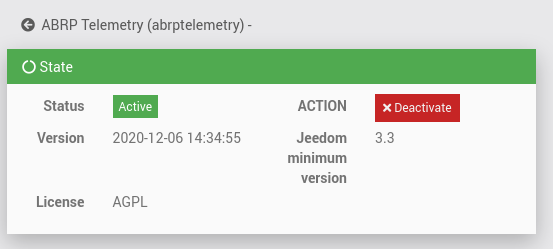
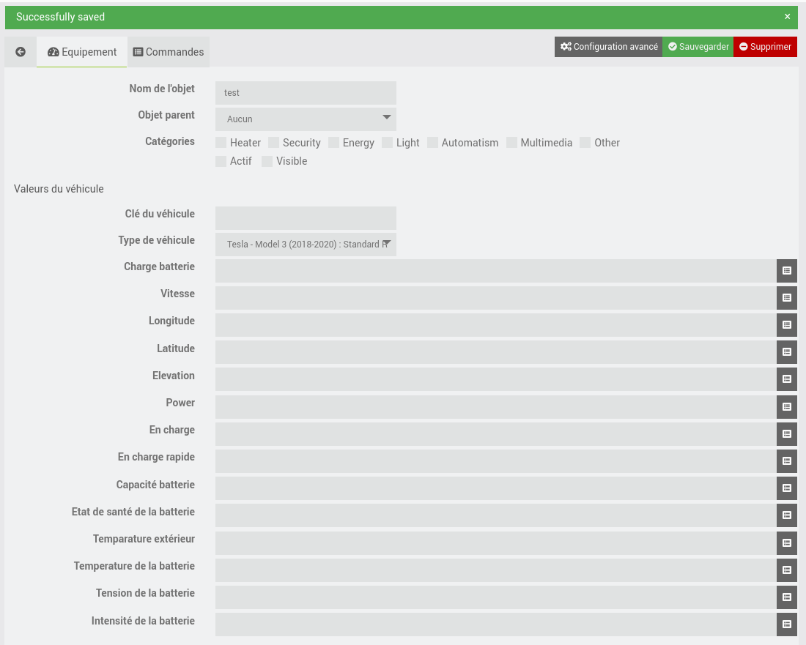
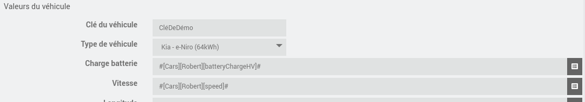
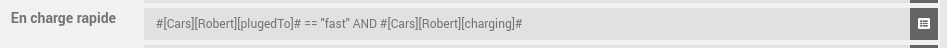
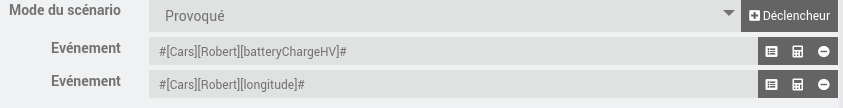
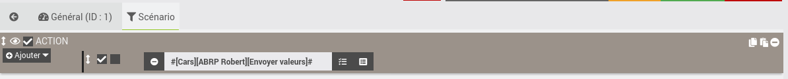

# Plugin ABRP Telemetry

## Présentation

Ce plugin Jeedom `abrptelemetry` permet de transmettre les valeurs d'un (ou plusieurs) véhicules électriques vers le système [ABRP](https://abetterrouteplanner.com/).

## Prérequis

- Avoir un véhicule electrique,
- Avoir un compte ABRP (gratuit ou premium)
- Avoir les informations de son véhicule dans Jeedom (via un plugin tiers).

Vous aurez besoin d'une clé véhicule, pour cela :
- Connectez vous avec votre compte sur [abetterrouteplanner.com](https://abetterrouteplanner.com/),
- Cliquez sur `Paramètres`,
- Cliquez sur `Modèle de véhicule` puis sur `Selectionnez le modèle` et selectionnez le votre,
- Cliquez ensuite sur `Ajouter ma voiture`,
- Une liste d'intégration vous est proposée, cliquez sur `Homey` et copiez la clé qui vous est fournie.

## Installation

Après le téléchargement du plugin, rendez vous sur sa page de configuration et activez le.

Vous êtes maintenant prêt pour créer votre véhicule.

## Configuration des véhicules

L'accès à la configuration du véhicule est possible via le menu plugin.

Cliquez sur ajouter et donnez un nom a votre véhicule. Vous serez redirigez vers la fiche du véhicule. Vous y retrouvez les options habituels Jeedom ainsi que la configuration propre du véhicule.

Commencez par activer cet objet en cochant la case `Actif`.

Entrez dans `Clé du véhicule` la clé véhicule fournie par abrp dans les prérequis. Sélectionnez ensuite le type de véhicule parmis la liste des modèles existants.

L'enssemble des champs restants sont a compléter avec les valeurs qui vous sont fournis par votre véhicule.

Il est aussi possible d'appeler des fonction ou d'utiliser des opérateurs logiques.

Les champs vides  ne seront pas transmis à ABRP.

Sauvegardez vos informations.

## Transmission des données

Chaque objet dispose d'une seule commande permettant d'envoyer les données du véhicule vers ABRP. Il est possible de la déclencher manuellement ou via un scénario.

Pour cela, créez un scénario en mode `Provoqué` et ajoutez définissez-y les modifications de propriété qui lanceront le scénario.

Dans l'onglet scénario, ajoutez une action qui déclenchera l'envoie des valeurs.

Une synchronisation est maintenant en place, à chaque changement des valeurs que vous avez indiqué dans les `déclencheurs`, un envoie des valeurs sera réalisé.